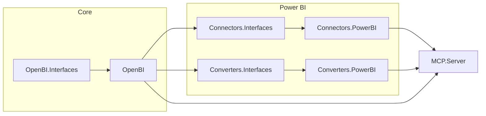

# OpenBI

**Version 0.1.0** · [openbusinessintelligence.net](https://openbusinessintelligence.net) · [](https://github.com/open-business-intelligence/openbi/actions/workflows/ci.yml)

OpenBI is an open standard for representing and manipulating business intelligence assets across platforms. This repository ships the core model, connector/converter contracts, a Microsoft Power BI implementation, and a reference [Model Context Protocol](https://modelcontextprotocol.io/) (MCP) server.

## Repository layout

| Area | Projects |
|------|----------|
| **Core** | `OpenBI`, `OpenBI.Interfaces`, `OpenBI.Common` |
| **Connectors** | `OpenBI.Connectors.Interfaces`, `OpenBI.Connectors.PowerBI` |
| **Converters** | `OpenBI.Converters.Interfaces`, `OpenBI.Converters.PowerBI` |
| **Reference host** | `OpenBI.MCP.Server` |



## Requirements

- [.NET SDK 9.0](https://dotnet.microsoft.com/download) (see `global.json`)
- Docker (optional, for MCP server container)

## Build and test

```bash
dotnet build OpenBI.slnx
dotnet test OpenBI.slnx
```

## Run the MCP server locally

```bash
dotnet run --project OpenBI.MCP.Server/OpenBI.MCP.Server.csproj
```

Configure sites under `OpenBI.MCP.Server/sites/` and credentials under `OpenBI.MCP.Server/secrets/` (see `sites/README.md` and `secrets/README.md`). Copy `*.example.json` files and fill in your values; never commit real secrets.

## Docker

```bash
docker compose up --build
```

The server listens on port **8080**. Compose mounts `sites/`, `secrets/`, and `platforms/` from `OpenBI.MCP.Server/`.

## Extending OpenBI

- **New platform connector:** implement `ISiteConnection` / `ISiteConnectionFactory` in a new assembly under `OpenBI.Connectors/`.
- **New converter:** implement `IOpenBIConverter` / `IOpenBIConverterFactory` under `OpenBI.Converters/`.
- Register factories in site JSON (`siteConnectionFactoryName`, `siteConverterFactoryName`).

See [CONTRIBUTING.md](CONTRIBUTING.md).

## License

Apache License 2.0 — see [LICENSE](LICENSE).

### Third-party dependency notices

This project references the following packages under proprietary Microsoft license terms:

| Package | License |
|---------|---------|
| [`Microsoft.Fabric.Api`](https://www.nuget.org/packages/Microsoft.Fabric.Api) | [Microsoft Software License Terms](https://www.nuget.org/packages/Microsoft.Fabric.Api/1.0.0-beta.23/license) |
| [`Microsoft.AnalysisServices`](https://www.nuget.org/packages/Microsoft.AnalysisServices) | [Microsoft Software License Terms](https://www.nuget.org/packages/Microsoft.AnalysisServices/19.104.1/license) (includes distributable code provisions) |

These packages are fetched at build time from [nuget.org](https://nuget.org) and are not redistributed as part of this repository. By building or running this project you accept the respective license terms.

> **Pre-release dependencies:** `ModelContextProtocol` and several Microsoft APIs used here are in preview or beta. The project is accordingly versioned at `0.1.0` and should be treated as experimental.
